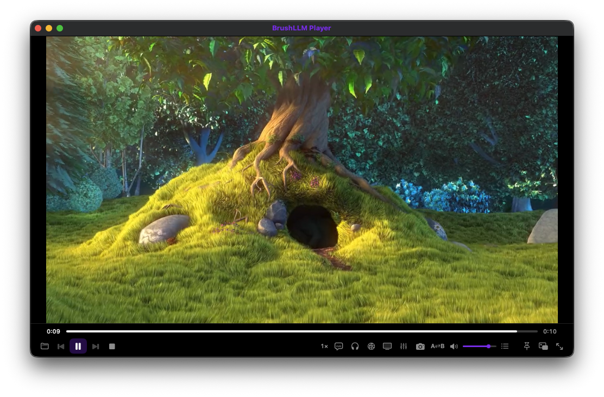

<p align="center">
  
</p>

<h1 align="center">BrushLLM Player</h1>

<p align="center">
  <strong><a href="https://www.brushllm.com">🌐 brushllm.com</a></strong> · <a href="https://github.com/BrushLLM/brushllm-player/releases">Releases</a>
</p>

<p align="center">An open-source cross-platform media player built on mpv — plays virtually every format, streams from WebDAV / SMB / FTP / Emby / Jellyfin, and ships a 9-language UI.</p>

<p align="center">
  
</p>

[English](#english) | [Deutsch](#deutsch) | [Español](#español) | [Français](#français) | [Português (BR)](#português-br) | [简体中文](#简体中文) | [繁體中文](#繁體中文) | [日本語](#日本語) | [한국어](#한국어)

---

## English

### ✨ Features

**Playback** — powered by mpv:

| Capability | Details |
| --- | --- |
| Formats | Every format mpv supports (MKV, MP4, AVI, MOV, WebM, FLAC, MP3, …) |
| Hardware decoding | VideoToolbox on macOS, live toggle |
| HDR output | PQ + EDR |
| Disc images | ISO Blu-ray (largest title) and DVD (seamless multi-VOB via EDL) |
| Navigation | A-B loop, playback speed, frame stepping, chapters |

**Media servers** — browse and play directly from:

| Protocol | Details |
| --- | --- |
| WebDAV | Full connection settings (scheme, host, port, path) |
| SMB | Native macOS mount |
| FTP | Built-in client (MLSD/LIST) |
| Emby / Jellyfin | Login, library browsing, direct-stream playback |

**Network streams**: HTTP(S) direct links and m3u8/HLS, with adjustable read-ahead buffer and User-Agent.

**Subtitles**: auto-load matching sidecar files, external subtitle loading, live styling (font, size, color, position).

**Library & tools**: playlist with drag-reorder · history with resume · bookmarks · screenshots · stream recording · equalizer · mini floating window.

**Highlights:** 9-language UI with instant switching · manual check-for-updates · zero telemetry.

### 📥 Download

Grab the latest installer from [Releases](https://github.com/BrushLLM/brushllm-player/releases):

| Platform | File |
| --- | --- |
| macOS (Apple Silicon, M-series) | `.dmg` (arm64) |
| Windows 10/11 — x64 (Intel/AMD) | `.exe` (x64) |
| Windows 10/11 — ARM64 (Snapdragon) | `.exe` (arm64) |

Apps are unsigned — macOS Gatekeeper / Windows SmartScreen show a first-run warning.

### 🛠 Develop

```bash
# macOS (Swift)
./scripts/build-app.sh debug     # build + assemble .app
./scripts/build-app.sh release   # optimized build
open "build/BrushLLM Player.app"

# Windows (Tauri) — run on Windows
cd tauri && npm install
npx tauri build                  # NSIS installer (mpv goes in src-tauri/bin/)
```

macOS requires Xcode 15+ (Swift 5.9); Swift Package Manager resolves MPVKit automatically. Windows requires Node 18+, Rust, and the [mpv binary](https://mpv.io/installation/) unpacked into `tauri/src-tauri/bin/`.

### Architecture

- **macOS app** — Swift 5 + SwiftUI + AppKit, dark glass design system. Playback core: libmpv via [MPVKit](https://github.com/MPVKit/MPVKit) (GPL build), OpenGL render API. Media servers: URLSession (WebDAV PROPFIND, Emby/Jellyfin REST), Network.framework (FTP), mount_smbfs (SMB). Persistence: UserDefaults (settings), Keychain (server passwords/tokens), JSON (history/bookmarks).
- **Windows app** — Tauri 2 + React + Rust; spawns the bundled mpv binary and controls it over JSON IPC (Unix domain socket / Windows named pipe).
- **Localization** — 9 language tables compiled into the binary; runtime switching with no restart.
- **Update checks** — manual button in Settings; queries the GitHub releases API and opens the release page in the browser (no automatic downloads).

### Known limitations

- The Windows app is a newer cross-platform rewrite — it currently covers playback, controls and file opening; the remaining macOS features are being migrated.
- Apps are unsigned (code signing can be added to CI later).
- Licensed under GPL v3 (mpv / libmpv licensing).

---

## Deutsch

Ein Open-Source-Mediaplayer auf mpv-Basis — spielt praktisch jedes Format, streamt von WebDAV / SMB / FTP / Emby / Jellyfin und bietet eine 9-sprachige Oberfläche.

**Funktionen:** Hardware-Dekodierung · HDR · A-B-Wiederholung · Geschwindigkeit · Einzelbildschritte · ISO-Disc-Images (Blu-ray/DVD) · WebDAV, SMB, FTP, Emby/Jellyfin · HTTP/HLS-Streams · Untertitel (automatisch laden, externe Dateien, Live-Styling) · Wiedergabeliste · Kapitel · Verlauf mit Fortsetzen · Lesezeichen · Screenshots · Aufnahmen · Equalizer · Mini-Fenster.

**Highlights:** UI in 9 Sprachen mit sofortigem Wechsel · manuelle Update-Prüfung · keine Telemetrie.

**📥 Herunterladen:** aktuelle Installationspakete auf [Releases](https://github.com/BrushLLM/brushllm-player/releases) — macOS `.dmg` (Apple Silicon), Windows `.exe` (x64 / ARM64). Unsignierte Apps lösen beim ersten Start eine Warnung aus (macOS: Rechtsklick → „Öffnen“; Windows: „Ausführen“ wählen).

Entwicklung und Architektur findest du im Abschnitt [English](#english).

---

## Español

Un reproductor multimedia de código abierto basado en mpv — reproduce casi cualquier formato, transmite desde WebDAV / SMB / FTP / Emby / Jellyfin e incluye una interfaz en 9 idiomas.

**Funciones:** decodificación por hardware · HDR · bucle A-B · velocidad · avance por fotogramas · imágenes de disco ISO (Blu-ray/DVD) · WebDAV, SMB, FTP, Emby/Jellyfin · transmisiones HTTP/HLS · subtítulos (carga automática, archivos externos, estilo en vivo) · lista de reproducción · capítulos · historial con reanudación · marcadores · capturas · grabaciones · ecualizador · mini ventana.

**Highlights:** interfaz en 9 idiomas con cambio instantáneo · comprobación manual de actualizaciones · sin telemetría.

**📥 Descarga:** instaladores en [Releases](https://github.com/BrushLLM/brushllm-player/releases) — macOS `.dmg` (Apple Silicon), Windows `.exe` (x64 / ARM64). Apps sin firmar: en el primer inicio, macOS exige clic derecho → *Abrir*; Windows muestra SmartScreen → *Ejecutar de todas formas*.

Desarrollo y arquitectura: ver la sección [English](#english).

---

## Français

Un lecteur multimédia open source basé sur mpv — lit pratiquement tous les formats, diffuse depuis WebDAV / SMB / FTP / Emby / Jellyfin et propose une interface en 9 langues.

**Fonctions :** décodage matériel · HDR · boucle A-B · vitesse · pas à pas image · images disque ISO (Blu-ray/DVD) · WebDAV, SMB, FTP, Emby/Jellyfin · flux HTTP/HLS · sous-titres (chargement auto, fichiers externes, style en direct) · liste de lecture · chapitres · historique avec reprise · favoris · captures · enregistrements · égaliseur · mini-fenêtre.

**Points forts :** interface en 9 langues à changement instantané · vérification manuelle des mises à jour · aucune télémétrie.

**📥 Téléchargement :** installateurs sur [Releases](https://github.com/BrushLLM/brushllm-player/releases) — macOS `.dmg` (Apple Silicon), Windows `.exe` (x64 / ARM64). Apps non signées : au premier lancement, macOS exige clic droit puis *Ouvrir* ; Windows affiche SmartScreen → *Exécuter quand même*.

Développement et architecture : voir la section [English](#english).

---

## Português (BR)

Um reprodutor de mídia de código aberto baseado em mpv — reproduz praticamente qualquer formato, transmite de WebDAV / SMB / FTP / Emby / Jellyfin e tem interface em 9 idiomas.

**Recursos:** decodificação por hardware · HDR · loop A-B · velocidade · avanço por quadro · imagens de disco ISO (Blu-ray/DVD) · WebDAV, SMB, FTP, Emby/Jellyfin · streams HTTP/HLS · legendas (carregamento automático, arquivos externos, estilo ao vivo) · playlist · capítulos · histórico com retomada · marcadores · capturas de tela · gravações · equalizador · mini janela.

**Destaques:** interface em 9 idiomas com troca instantânea · verificação manual de atualizações · zero telemetria.

**📥 Download:** instaladores em [Releases](https://github.com/BrushLLM/brushllm-player/releases) — macOS `.dmg` (Apple Silicon), Windows `.exe` (x64 / ARM64). Apps não assinados: no primeiro uso, macOS exige clique com o botão direito → *Abrir*; Windows mostra SmartScreen → *Executar assim mesmo*.

Desenvolvimento e arquitetura: veja a seção [English](#english).

---

## 简体中文

一个基于 mpv 的开源跨平台媒体播放器 —— 支持几乎所有格式，可从 WebDAV / SMB / FTP / Emby / Jellyfin 流媒体服务器直接播放，内置 9 语言界面。

**功能**：硬件解码 · HDR 输出 · A-B 循环 · 变速播放 · 逐帧步进 · ISO 光盘镜像（蓝光/DVD）· WebDAV、SMB、FTP、Emby/Jellyfin 媒体服务器 · HTTP/HLS 网络流 · 字幕（自动加载、外部文件、实时样式调整）· 播放列表 · 章节 · 带断点续播的历史记录 · 书签 · 截图 · 录制 · 均衡器 · 迷你悬浮窗。

**亮点**：9 语言界面即时切换 · 手动检查更新 · 零遥测。

**📥 下载**：最新安装包见 [Releases](https://github.com/BrushLLM/brushllm-player/releases) —— macOS `.dmg`（Apple Silicon）、Windows `.exe`（x64 / ARM64）。应用未签名 —— macOS 首次启动请右键选择“打开”；Windows 遇 SmartScreen 警告请选择“仍要运行”。

开发与架构详情见 [English](#english)。

---

## 繁體中文

一個基於 mpv 的開源跨平台媒體播放器 —— 支援幾乎所有格式，可從 WebDAV / SMB / FTP / Emby / Jellyfin 串流伺服器直接播放，內建 9 語言介面。

**功能**：硬體解碼 · HDR 輸出 · A-B 循環 · 變速播放 · 逐幀步進 · ISO 光碟映像檔（藍光/DVD）· WebDAV、SMB、FTP、Emby/Jellyfin 媒體伺服器 · HTTP/HLS 網路串流 · 字幕（自動載入、外部檔案、即時樣式調整）· 播放清單 · 章節 · 帶斷點續播的歷史記錄 · 書籤 · 截圖 · 錄製 · 等化器 · 迷你懸浮窗。

**亮點**：9 語言介面即時切換 · 手動檢查更新 · 零遙測。

**📥 下載**：最新安裝包見 [Releases](https://github.com/BrushLLM/brushllm-player/releases) —— macOS `.dmg`（Apple Silicon）、Windows `.exe`（x64 / ARM64）。應用程式未簽署 —— macOS 首次啟動請右鍵選擇「開啟」；Windows 遇 SmartScreen 警告請選擇「仍要執行」。

開發與架構詳情見 [English](#english)。

---

## 日本語

mpv ベースのオープンソース・クロスプラットフォームメディアプレイヤーです。ほぼすべての形式を再生し、WebDAV / SMB / FTP / Emby / Jellyfin から直接ストリーミングでき、9 言語の UI を搭載しています。

**機能**：ハードウェアデコード · HDR 出力 · A-B ループ · 速度変更 · コマ送り · ISO ディスクイメージ（Blu-ray/DVD）· WebDAV、SMB、FTP、Emby/Jellyfin · HTTP/HLS ストリーム · 字幕（自動読み込み、外部ファイル、ライブスタイル調整）· プレイリスト · チャプター · レジューム付き履歴 · ブックマーク · スクリーンショット · 録画 · イコライザー · ミニウィンドウ。

**ハイライト**：9 言語 UI の即時切替 · 手動アップデート確認 · テレメトリなし。

**📥 ダウンロード**：最新のインストーラーは [Releases](https://github.com/BrushLLM/brushllm-player/releases) —— macOS `.dmg`（Apple Silicon）、Windows `.exe`（x64 / ARM64）。アプリは未署名です —— macOS は初回起動時に右クリックで「開く」を選択、Windows は SmartScreen の警告で「実行」を選んでください。

開発とアーキテクチャの詳細は [English](#english) を参照。

---

## 한국어

mpv 기반의 오픈소스 크로스 플랫폼 미디어 플레이어입니다. 거의 모든 형식을 재생하고, WebDAV / SMB / FTP / Emby / Jellyfin에서 직접 스트리밍할 수 있으며, 9개 언어 UI를 제공합니다.

**기능**: 하드웨어 디코딩 · HDR 출력 · A-B 루프 · 배속 재생 · 프레임 단위 이동 · ISO 디스크 이미지(블루레이/DVD) · WebDAV, SMB, FTP, Emby/Jellyfin · HTTP/HLS 스트림 · 자막(자동 불러오기, 외부 파일, 실시간 스타일 조정) · 재생목록 · 챕터 · 이어보기 기록 · 북마크 · 스크린샷 · 녹화 · 이퀄라이저 · 미니 창.

**하이라이트**: 9개 언어 UI 즉시 전환 · 수동 업데이트 확인 · 텔레메트리 없음.

**📥 다운로드**: 최신 설치 파일은 [Releases](https://github.com/BrushLLM/brushllm-player/releases) —— macOS `.dmg`(Apple Silicon), Windows `.exe`(x64 / ARM64). 앱은 서명되지 않았습니다 —— macOS는 첫 실행 시 마우스 오른쪽 클릭으로 *열기*를, Windows는 SmartScreen 경고에서 *실행*을 선택하세요.

개발 및 아키텍처 세부 사항은 [English](#english)를 참조하세요.
